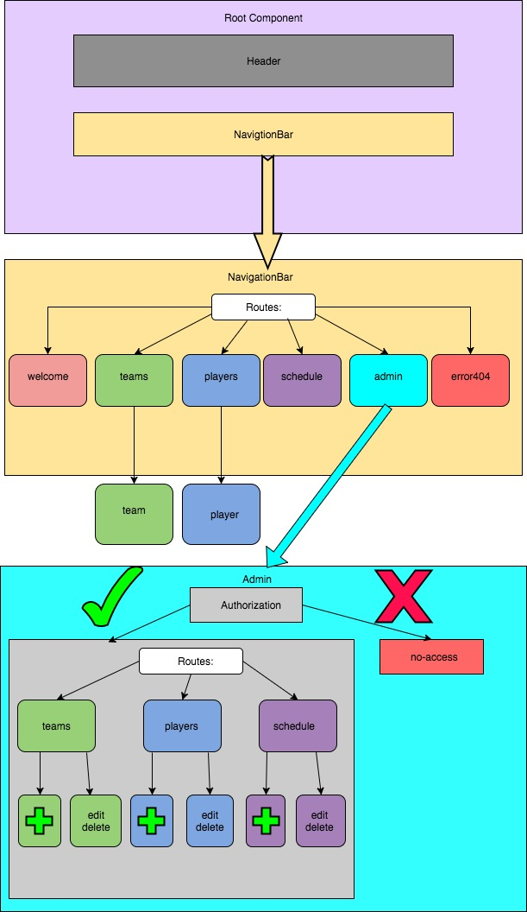
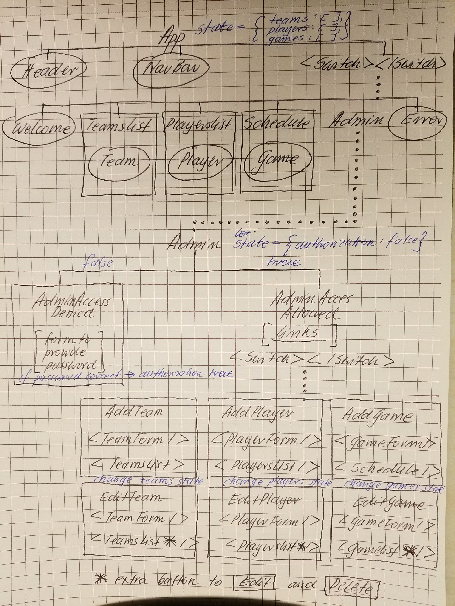

# Seattle Baseball League

### It's an application to track baseball league in Seattle.

#### By Malgorzata Haniszewska

## Description

This website manages a baseball league in Seattle.
* User can visit a page to see a welcome information.
* User can click on Teams link to visit a page which contains all teams.
* Each team has details such as: name, manager and list of players.
* User can click on Players link to visit a page which contains all players.
* Each player has details such as: name, age, position, team and Jersey number.
* User can click on Schedule link to visit a page which contains all games.
* Each game has details such as: home team and its scores, away team and its scores, date and field.
* Administrator can edit and delete data only when is logged in.
#### Differences in development process in Angular versus React:

## Visual Representation of Component Tree

## Visual Representation of Component Tree After Adding State

## Notes

* Think about how to add authentication for Admin
* How to add filter to display only certain types of objects e.g. by team name in Schedule component

## Setup/Installation Requirements

* Clone GitHub repository to your personal device using terminal command `git clone https://github.com/yetka/react-baseball-league`
* go to root directory of this project
* run `npm install`
* run `npm run start`
* navigate to `http://localhost:8080/` in the browser; the app will automatically reload if you change any of the source files

## Support and contact details

Contact emails: gosia.haniszewska@gmail.com

## Running linter

Run `npm run lint` to execute tests via [ESLint](https://eslint.org).

## Technologies Used

* HTML
* CSS
* JSX
* Babel
* Webpack
* React
* React-Router
* ESLint

## License

This project is licensed under the MIT License.
